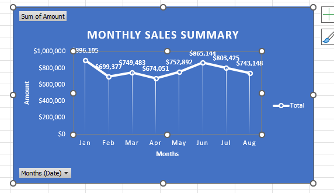
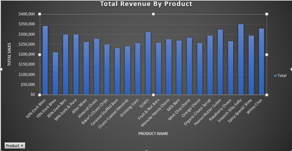
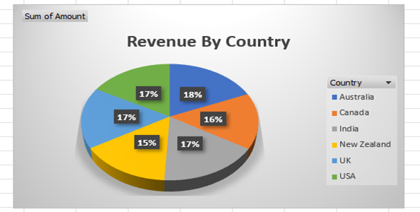
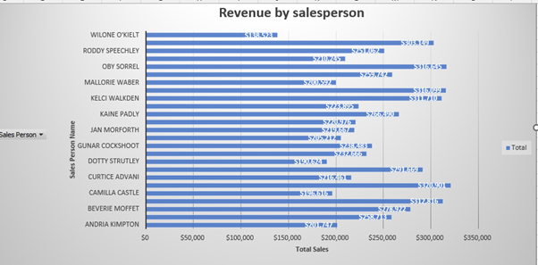
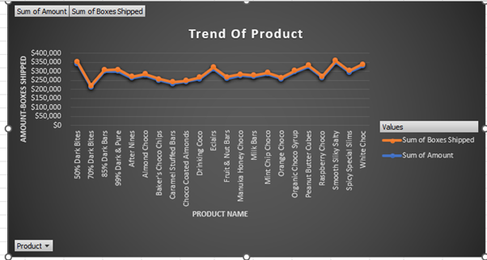

# Excel_project
# Chocolate Sales Analysis

This summary provides insights into chocolate product sales based on multiple dimensions, including time, product, country, salesperson, and shipping trends.

---

## 📊 1. Overall Dataset Summary

The main data sheet titled 'IN' includes fields:
- **Sales Person**
- **Country**
- **Product**
- **Date**
- **Amount**
- **Boxes Shipped**

It captures transaction-level data such as who sold what, where, when, and how much.

---

## 📅 2. Sales Over Time
---
📊 Monthly Sales Summary – Analysis from Chart
- This line chart titled "Monthly Sales Summary" displays the total chocolate sales amount per month from January to August.
  

---
# -🔍 Key Observations:
- Month	Sales Amount	Change Direction
- Jan	896,105	Peak (High)
- Feb	699,377	📉 Drop
- Mar	749,483	📈 Increase
- Apr	674,051	📉 Drop
- May	752,892	📈 Recovery
- Jun	865,144	📈 Rise
- Jul	803,425	📉 Slight Drop
- Aug	743,148	📉 Drop
---
| Month | Total Sales Amount |
|-------|---------------------|
| Jan   | 896,105             |
| Feb   | 699,377             |
| Mar   | 749,483             |

- **January** had the highest sales.
- A gradual **decrease** is observed in the following months.

# 📌 Insights:
- January shows the highest sales — possibly due to holiday aftermath, promotions, or New Year celebrations.
- February and April experience noticeable drops, which could signal post-holiday slowdowns or reduced customer engagement.
- June bounces back strongly with a second-highest sales, suggesting a mid-year demand spike — potentially tied to summer events or
-  marketing efforts.
- August trends downward again, possibly due to vacation season or decreased buying interest.

# 📈 Business Takeaways:
- Leverage January and June for major campaigns and inventory boosts.
- Investigate low-performing months (Feb, Apr, Aug) for potential promotions or product pushes.
- Plan staffing and logistics based on the sales rhythm shown here.

---

## 🍫 3. Top Products by Sales

- 🍫 Total Revenue by Product – Analysis Summary
- This bar chart titled "Total Revenue By Product" displays the total sales for various chocolate products. Each bar represents a 
- specific product’s total revenue, providing a clear comparison of product performance.
---

| Product          | Sales Amount |
|------------------|--------------|
| 50% Dark Bites   | 341,712      |
| 85% Dark Bars    | 299,229      |
| 70% Dark Bites   | 211,610      |

- **50% Dark Bites** is the most sold product in terms of revenue.
---

---
- 🔝 Top Performing Products (Highest Revenue):
- 50% Dark Bites – The highest grossing product, nearing $350,000+.
- Spicy and White Choco – Another strong performer, close to $350,000.
- 70% Dark Bites and Raspberry Choco – Also stand out with high sales.
- Eclairs and Choco-Coated Almonds – Consistently in the top tier of revenue generation.

- 📉 Lower Revenue Products:
- 98% Dark Bites, Fruit Mix, and Mint Chips Choco are among the lower performers, though still contributing significantly to total 
 sales.
- These might need promotion, repackaging, or repositioning to increase demand.

# 📌 Business Insights:
- Focus on expanding the top 5 best-selling products — consider bundling, upselling, or offering special editions.
- For mid-range products, maintain visibility but monitor performance.
- Low-performing products could be evaluated for marketing push or phased out if margins are weak.

---

## 🌍 4. Sales by Country

| Country   | Sales Amount |
|-----------|--------------|
| Australia | 1,137,367    |
| India     | 1,045,800    |
| Canada    | 962,899      |

- **Australia** leads in chocolate consumption.
- India is a close second.
---
  

This **pie chart** displays the distribution of chocolate sales revenue across six different countries. Each country's contribution is represented as a percentage of the total revenue. Here's the breakdown:

- **Australia**: 18% - The highest revenue contributor among the countries.
- **Canada**: 16%
- **India**: 17%
- **New Zealand**: 15% - The lowest contributor in this distribution.
- **UK**: 17%
- **USA**: 17%

### Business Insights:
- The revenue is fairly evenly distributed among all the countries, with only a 3% difference between the highest (Australia) and the lowest (New Zealand).
- This balanced distribution indicates strong global market penetration and a well-diversified revenue stream.

---

## 🧑‍💼 5. Top Salespeople

| Salesperson       | Sales Amount |
|-------------------|--------------|
| Beverie Moffet    | 278,922      |
| Barr Faughny      | 258,713      |
| Andria Kimpton    | 201,747      |

- **Beverie Moffet** is the top-performing salesperson.
- This horizontal bar chart showcases the total revenue generated by each salesperson. Key highlights from the chart:
---

---

## 📦 6. Product Trends (Volume vs Value)

| Product          | Sales Amount | Boxes Shipped |
|------------------|--------------|----------------|
| 50% Dark Bites   | 341,712      | 9792           |
| 70% Dark Bites   | 211,610      | 8015           |
| 85% Dark Bars    | 299,229      | 7793           |

- Products like **70% Dark Bites** have a high volume but slightly lower revenue — good for volume sales strategy.
---

---
- This dual-line chart visualizes the relationship between revenue (Amount) and units sold (Boxes Shipped) across various chocolate products.

- Key Observations:
- Parallel Trends: The two lines (orange for Boxes Shipped, blue for Amount) generally follow a similar trend, indicating that sales amount is directly influenced by quantity shipped.

- High Performers:
- 50% Dark Bites, Fruit Nut Barks, and White Choc show strong peaks in both amount and boxes shipped, suggesting high demand and good revenue generation.
- Low Variance Products:
- Products like Drinking Cocoa, Mint Chip Choco, and Choco-Coated Almonds maintain consistent levels, neither peaking nor dropping drastically.
- Divergences:
- A few minor gaps between the two lines might suggest:
- Price differences across products or promotions/discounts affecting the revenue independently of volume
---
---
## 📌 Insights & Recommendations for Business

- Focus on promoting **top-selling products** like 50% Dark Bites and 85% Dark Bars.
- Boost sales efforts in **India** and **Canada** to match or exceed Australia's performance.
- Reward top salespeople and train others using their strategies.
- Consider bundling or campaigns during **January**, the best-performing month.

---

